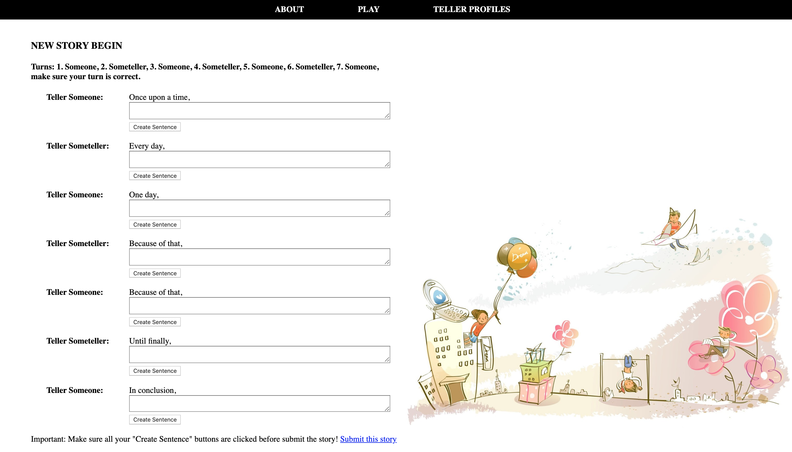

# Welcome to Story Telling!

Story Telling is a communication game that can be played anytime and anywhere by a group of people!

## Instructions

Fork and clone the repository. You will need to have Ruby and Rails installed on your device.

Open the directory in your terminal.

Enter: `bundle install` to install the necessary gems.

Enter: `rails db:migrate` to create the database.

Enter: `rails db:seed` to add intial data to the database.

## 

